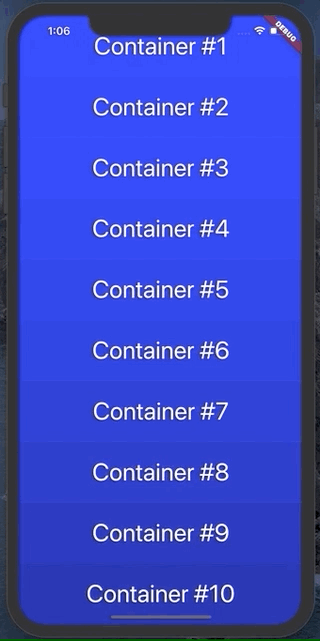
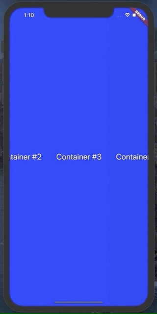
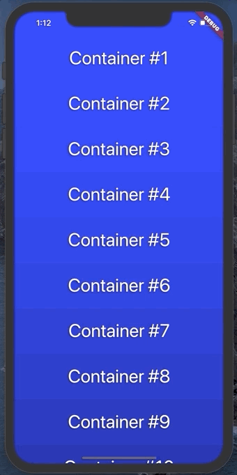

# Spinner

This flutter package implements a simple Spinner animation that cycles through any number of fixed size child widgets. Useful for selecting a random word from a list and displaying it to a user.

It can animate vertically, up or down:

Or horizontally, left or right:

# API

Spinner has several useful parameters. You can see them used in the example file

* `duration`: change the duration of the animation

* `animationSpeed`: change how fast the animation moves and what index the animation lands on

* `spinDirection`: change the direction of animation

* `containerCount`: number of containers that should appear on screen

* `containerSize`: for vertical scroll, this is the width of each container produced by the builder function. For horizontal, this is the height

* `builder`: a function that takes in an integer and returns a widget with height/width of containerSize

* `curve`: the curve for the animation to follow. Defaults to easeInOutCubic

* `callback`: a function called when the animation completes

* `zoomFactor`: optional zoom in by this amount during the animation. It looks something like this, with a zoom factor of 1.5:

